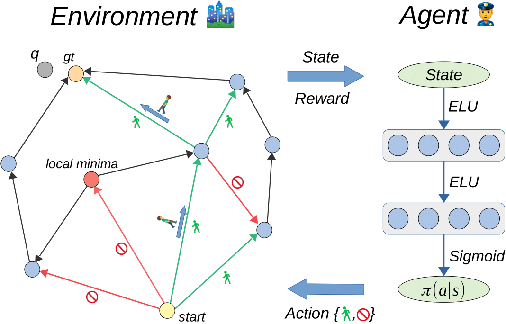
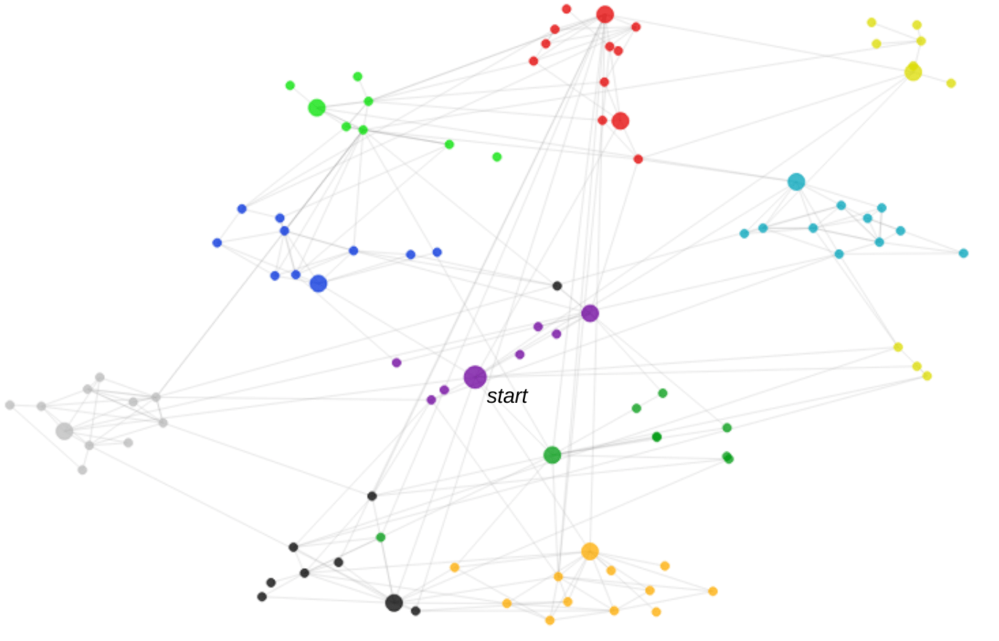

# Towards Similarity Graphs Constructed by Deep Reinforcement Learning
Code for [paper](https://arxiv.org/abs/1911.12122) (The updated version will be released soon)

**NEW:** latest commit (02/2020) up to 5 times boost in training procedure
efficiency, accuracy improvement, more million-scale experiments

## Overview

The approach constructs similarity graphs for efficient nearest neighbor search using Reinforcement Learning machinery.

We formulate the similarity graph construction as Markov Decision Process. 

* The environment contains of the initial graph and search algorithm. 
* The agent utilizes the search algorithm to walk around the graph and decides what edges to eliminate. 
* The agent aims to maximize the expected reward, which is optimized by TRPO. 
    * The training process is highly optimized in order to deal with graphs with millions of edges.




## Toy Example

The graph constructed on 100 vectors from the MNIST8x8 dataset. The optimization is performed over the complete graph. Colors correspond to the MNIST class labels. The nodes providing efficient graph navigation (hubs) are denoted by large sizes. Each MNIST class contains up to two hubs.



## Dependecies 

* PyTorch >= 1.0.0 
* Python >= 3.5
* Install the libraries required to compile C++ parts of our framework
  * ```sudo apt-get install gcc g++ libstdc++6 wget curl unzip git```
  * ```sudo apt-get install swig3.0``` (or just swig)
  

## Run
1. Clone or download this repo. `cd` yourself to it's root directory.
2. Grab or build a working python enviromnent. [Anaconda](https://www.anaconda.com/) works fine.
3. Install packages from `requirements.txt`
4. Open jupyter notebook in `./notebooks/` and you're done!


## Reproducibility

Final hyperparameters can be found in Appendix. Not listed ones are set by default in jupyter notebooks in `./notebooks/` 

All tensorboard logs, trained agents and constructed graphs used for final evaluation are [here](TODO)
